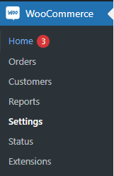
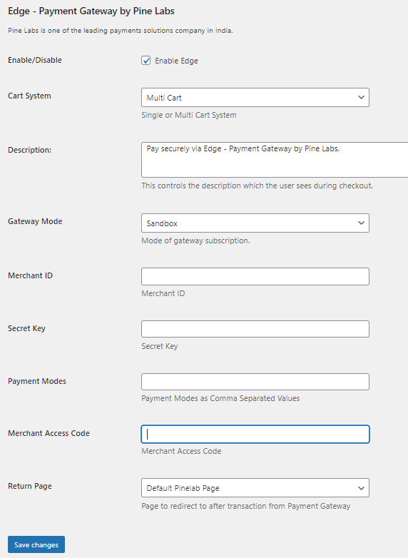
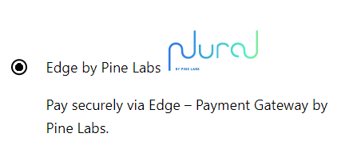
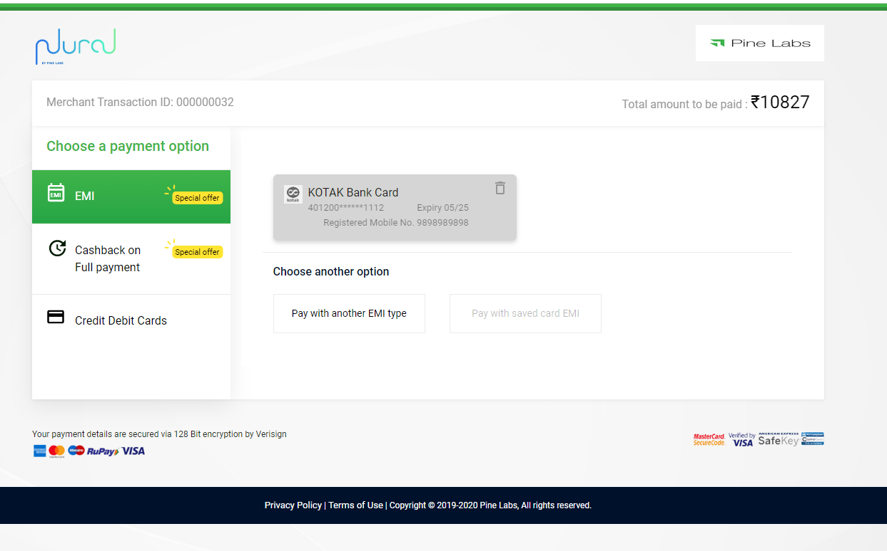
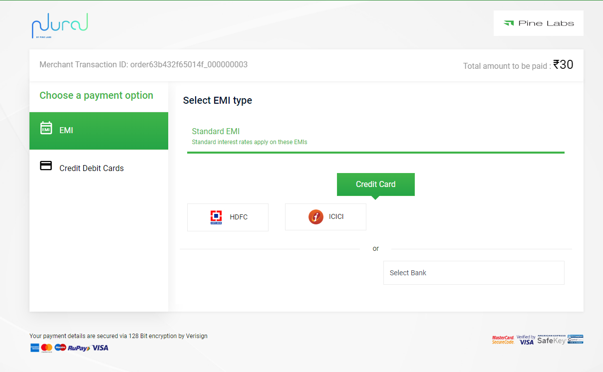
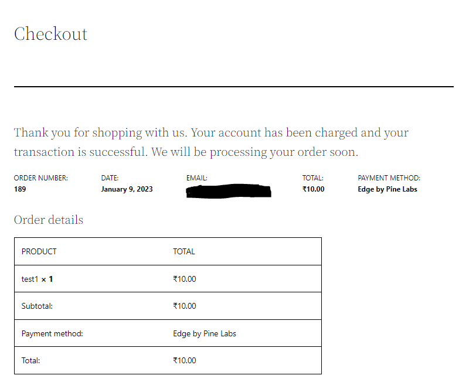
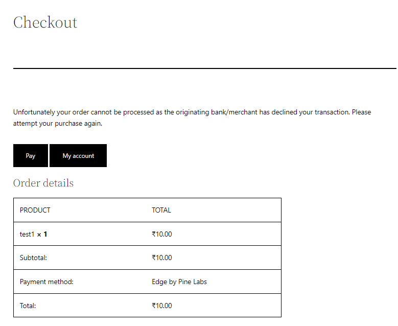

**INTEGRATION DOCUMENT**

**WordPress**

**Supported version:** 3.6.3v to 7.2.2v

**Introduction**

This guide will show you how to Install and configure the PinePG Edge
Plugin for WordPress on your Wordpress-powered website for payments
through Credit Card, Debit Card, and EMI. The plugin supports Payment
through the PinePG Edge platform.

**Steps to Integrate**

1.  First, download the extension files from the download link. This
    > will typically be in the form of a zip file.

2.  The Plugin can be installed in two ways:

    1)  WordPress plugin installer
    2)  Manual installation

1)  **WordPress plugin installer**

    a.  Login to WordPress Admin panel

    b.  Click the plugin tab

> 

c.  Click on the Add New Plugin button

> 

d.  Click the Upload Plugin button

> 

e.  Choose the downloaded zip file for edge plugin

> 

f.  After uploading the zip file click on the Install Now button

g.  Now click on the Activate button

> 

h.  You should get the plugin activated message and the installed plugin
    > can be seen as Edge by Pine Labs for WooCommerce

> 

2)  **Manual installation**

    a.  Unzip the file and then copy the folder from this unzip folder
        > and paste/upload it to \<wordpress root\>\\wp-content\\plugins
        > folder.

    b.  Login to the WooCommerce admin panel and go to the Plugins

> 

c.  Activate the Edge Plugin by clicking on the Active button

> 

**Steps for Plugin Configuration**

1.  Click on the WooCommerce -\> setting tab

> 

2.  Click on the Payments Tab

> 

3.  Click on the Edge plugin name

> 

4.  In this list, you should see the payment method provided by the
    > extension you installed. If it is listed there, the extension has
    > been installed successfully and is ready for use.

> In this extension fill up the required fields like Merchant Key,
> Access Code, Merchant secret, etc.
>
> 

**4.1** Enable: 'Yes' to enable the module.

**4.2** Cart System: This option has Single and Multi-Cart options. If
you have credentials for a single cart, then select the Single Cart
option. If you have credentials for a multi-cart, then select the
Multi-Cart option.

**4.3** Description: Enter the appropriate description to display on the
checkout page.

**4.4** Gateway Mode: Sandbox for testing the payment gateway and
selecting Production for accepting the real payments.

**4.5** Merchant Id: add the Id as per the selected Payment Environment
(Test / Live)

**4.6** Merchant Access Code: add the Access Code as per the selected
Payment Environment (Test / Live)

**4.7** Merchant Secret: add the Merchant Secret as per the selected
Payment Environment (Test / Live)

**4.8** Payment Mode: Add a mode that is enabled for your merchant

**4.9** Return Page: Use My Account as the default return page after
payment response. You may create a custom page and select it here.
However, the custom page must contain appropriate WordPress /
WooCommerce codes to show custom messages. Refer WordPress / WooCommerce
development guide for custom pages.

Fill in the required fields and then click on the save changes button.

5.   After successfully installing the extension, you can see the
    > Payment method of your extension on your Checkout Page.

> {width="4.65625in" height="2.0in"}

6.  When you click on Place Order you will see the payment gateway
    > window where you must choose your payment options:

> In the case of a Special Offer
>
> 
>
> In the case of Standard EMI
>
> 

7.  After completing the payment successfully you will redirect to the
    > success page:

> 

8.  If the payment failed then the user can redirect to the failure
    > page.

> 

**Note:**

Pine Plugins don't handle shipping or any additional charges so cart
value must be equivalent to Product value hence take the same
internally.

Please note no additional charges like TDR, GST, etc are handled in our
Plugins and the same need to be manually handled at the merchant end.
